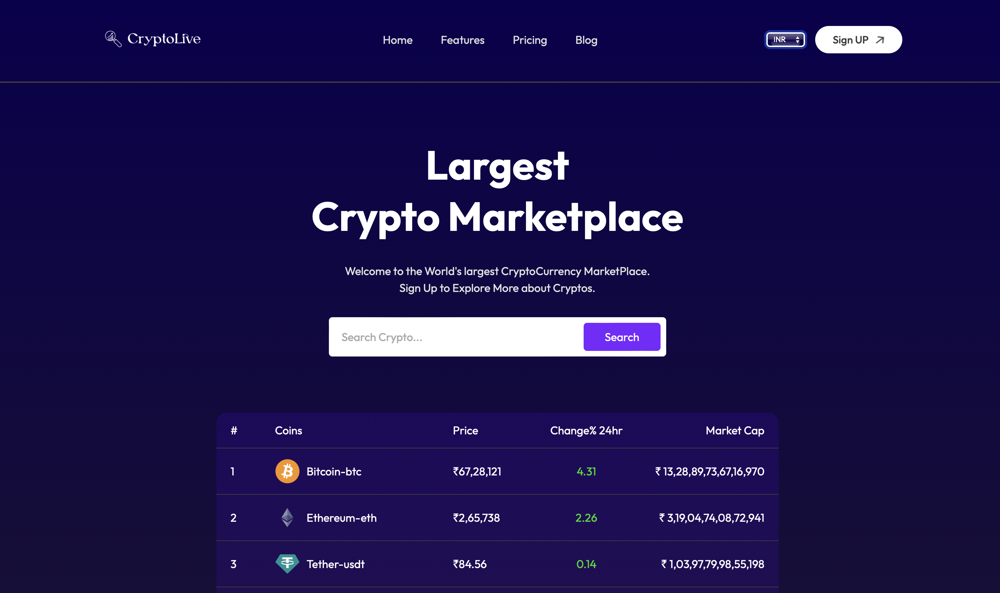
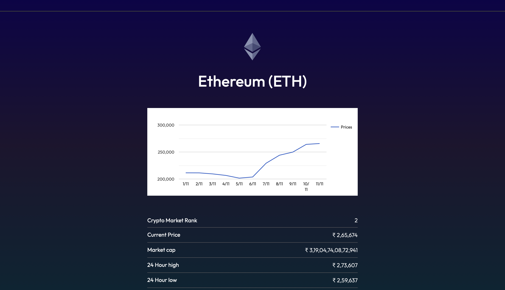

# Hii, I'm Swati Bhatt👩🏻‍💻!

# CryptoLive🔍  

CryptoLive aims to provide users with an intuitive interface to monitor live cryptocurrency prices and other relevant market data. With a simple and responsive design, CryptoLive offers a seamless experience for users to track their favorite cryptocurrencies in real-time.

[Visit Now🚀](https://swati-cryptolive.vercel.app/)

##  ☞Tech Stack Used 🖇️

- **API**: CoinGecko API
- **Deployment**: Vercel

##  ☞Features🧐
- **Live Price Tracking**: Get real-time prices of popular cryptocurrencies.
- **Market Data**: Access additional details such as market cap, volume, and price change percentages.
- **Search Functionality**: Search for specific cryptocurrencies.
- **Responsive Design**: Optimized for both desktop and mobile devices.

## Getting Started with Create React App🎬
Install Dependencies:
#### `npm install`
#### `npm i react-router-dom`

In the project directory, you can run:
#### `npx create-react-app .`  
#### `npm start`

Runs the app in the development mode.\
Open [http://localhost:3000](http://localhost:3000) to view it in your browser.
The page will reload when you make changes.\
You may also see any lint errors in the console.

#### `npm test`

Launches the test runner in the interactive watch mode.\

#### `npm run build`

Builds the app for production to the `build` folder.\
It correctly bundles React in production mode and optimizes the build for the best performance.

The build is minified and the filenames include the hashes.\
Your app is ready to be deployed!

## Future Enhancements🔮

- **User Authentication**: Enable personalized watchlists for registered users.
- **Historical Data Charts**: Show historical price trends with interactive charts.
- **Currency Conversion**: Add options to view prices in different fiat currencies.

##  ☞Sneak Peak 🫣

##  ☞Feedback✍🏻
I’d love to hear your thoughts on this project and would really appreciate any suggestions you have. Please feel free to reach out to me at:
get.swatibhatt@gmail.com

##  ☞Contact Me 📩
) 

